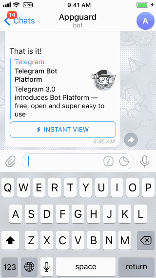

# TeleShellBot
A simple Telegram Bot to run shell commands remotely, so that you can maintain your server from mobile phones!


## Install
Download or clone this repo, then
```
npm install
```
## Config
Follow [Telegram instructions](https://telegram.org/blog/bot-revolution) to create a bot
Then put your telegram user ID and bot token in `config.js`:
```javascript
module.exports = {
    config:function(){
        return (
            {
                adminUsers:[ADMIN_ID], //admin users' telegram id, should be numbers
                botToken: 'YOUR_BOT_TOEKN', // bot token

            }
        );
    }
};
```
## Run
```
npm start
```
or 
```
node index.js
```

That is it!
